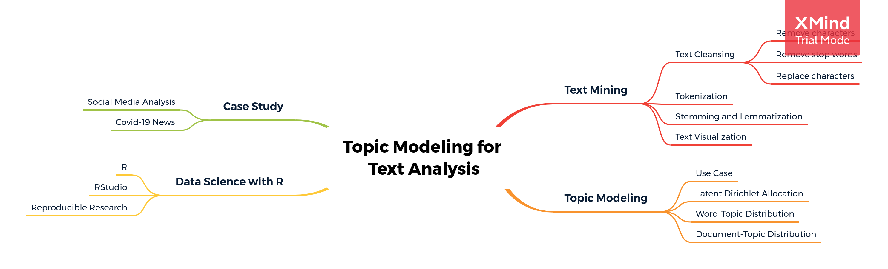

# Data Science Series: Topic Modeling for Text Analysis with R

The following coursebook is the main part for _Online Data Science Series: Topic Modeling for Text Analysis in R_ workshop produced by the team at [**Algoritma**](http://algorit.ma/) . [**Algoritma**](http://algorit.ma/) is a data science education center based in Jakarta. We organize workshops and training programs to help working professionals and students gain mastery in various data science sub-fields: data visualization, machine learning, data modeling, statistical inference, etc.

This 3-days online workshop is a beginner-friendly introduction to Topic Modeling using R. By performing topic model you can  organize, understand and summarize large collections of textual information from your text data. 

## Training Objectives

#### R PROGRAMMING BASICS

 - Introduction to R Programming Language
 - Working with R Studio Environment
 - Using R Markdown for reproducible research
 - Inspecting data structure

#### TEXT MINING USING R

 - Essence of Text Mining or Natural Language Processing
 - Working with a text corpus, a large and structured set of texts
 - Preparing your text data: data cleansing and manipulation
 - Word-tokenizing to identify word’s meaning
 - Using visualization to analyse text data

#### TOPIC MODELING FOR BUSINESS

 - Examples of utilizing topic modeling in various industries
 - Understanding the principles and workflow of topic modeling
 - Understanding LDA (Latent Dirichlet Allocation), the algorithm behind topic modeling
 - Exploring & Interpreting the output of a topic model