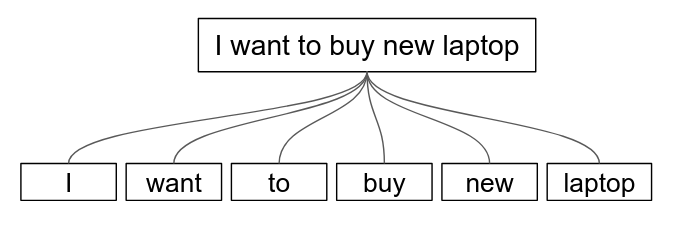

```{r setup, include=FALSE}
knitr::opts_chunk$set(echo = TRUE, fig.align = "center", message = F, warning = F, out.width = "80%")
```

\newpage

# Background {.tabset}
## Algoritma

The following coursebook is the main part for _Online Data Science Series: Topic Modeling for Text Analysis in R_ workshop produced by the team at [**Algoritma**](http://algorit.ma/) . [**Algoritma**](http://algorit.ma/) is a data science education center based in Jakarta. We organize workshops and training programs to help working professionals and students gain mastery in various data science sub-fields: data visualization, machine learning, data modeling, statistical inference, etc.

Before you go ahead and run the codes in this coursebook, it’s often a good idea to go through some initial setup. Under the **Training Objectives** section we’ll outline the syllabus, identify the key objectives and set up expectations for each module. Under the **Libraries and Setup** section you’ll see some code to initialize our workspace and the libraries we’ll be using for the projects. You may want to make sure that the libraries are installed beforehand by referring back to the packages listed here.  

## Libraries and Setup

In this **Library and Setup** section you’ll see some code to initialize our workspace, and the packages we’ll be using for this project. 

_Packages_ are collections of R functions, data, and compiled code in a well-defined format. The directory where packages are stored is called the _library_. R comes with a standard set of packages. Others are available for download and installation. Once installed, they have to be loaded into the session to be used. 

You will need to use `install.packages()` to install any packages that are not yet downloaded onto your machine. To install packages, type the command below on your console then press ENTER.

```{r eval=FALSE}
## DO NOT RUN CHUNK
# packages <- c("rmarkdown", "ggplot2", "dplyr", "lubridate", "stringr", "tidyr", "tidytext", "SnowballC", "hunspell", "textmineR", "ggwordcloud", "scales")
# 
# install.packages(packages)
```

To install `textclean` package, you will require the `pacman` package. Run the following code on your console to install the package.

```{r}
# if (!require("pacman")) install.packages("pacman")
# pacman::p_load_gh(
#     "trinker/lexicon",    
#     "trinker/textclean"
# )
```

Then you need to load the package into your workspace using the `library()` function. Special for this course, the _rmarkdown_ packages do not need to be called using `library()`.

```{r message=FALSE, warning=FALSE}
# Data Wrangling
library(dplyr) 
library(lubridate)
library(stringr)
library(tidyr)

# Text Analysis
library(tidytext)
library(textclean)
library(SnowballC)
library(hunspell)

# Topic Modeling
library(textmineR)

# Data Visualization
library(ggplot2)
library(ggwordcloud)
library(scales)

# Extra Function
source("extra_function.R")

options(scipen = 999)
```

## Training Objectives

This 3-days online workshop is a beginner-friendly introduction to Topic Modeling using R. By performing topic model you can  organize, understand and summarize large collections of textual information from your text data. 

```{r echo=FALSE}
knitr::include_graphics("assets/Topic Modeling for Text Analysis.png")
```


* **R PROGRAMMING BASICS**

 - Introduction to R Programming Language
 - Working with R Studio Environment
 - Using R Markdown for reproducible research
 - Inspecting data structure

* **TEXT MINING USING R**

 - Essence of Text Mining or Natural Language Processing
 - Working with a text corpus, a large and structured set of texts
 - Preparing your text data: data cleansing and manipulation
 - Word-tokenizing to identify word’s meaning
 - Using visualization to analyse text data

* **TOPIC MODELING FOR BUSINESS**

 - Examples of utilizing topic modeling in various industries
 - Understanding the principles and workflow of topic modeling
 - Understanding LDA (Latent Dirichlet Allocation), the algorithm behind topic modeling
 - Exploring & Interpreting the output of a topic model
 
# Preface

Natural Language Processing (NLP) is a branch of artificial intelligence that is steadily growing both in terms of research and market values1. The ultimate objective of NLP is to read, decipher, understand, and make sense of the human languages in a manner that is valuable2. The are many applications of NLP in various industries, such as:

- SPAM email detection
- Sentiment analysis
- Text summarization
- Text generation
- Topic modeling

On this occasion, we will learn about Topic modeling and its application in a real case. Before we start the journey, let’s consider a simple example. Suppose that we have the following word cloud, can you guess what these words have in common?

```{r echo=FALSE}

```

The interpretation may differ from one persone to another, but most of you must be agree that the word cloud has a common theme or topic. Perhaps you might say that it is related to economics, or politics, or business. The real theme of the words is unkown, but we as the observer are giving the group of words a meaningful and understandable topic. This activity is what we call as **Topic Modeling**.

> In text mining, we often have collections of documents, such as blog posts or news articles, that we’d like to divide into natural groups so that we can understand them separately. Topic modeling is a method for unsupervised classification of such documents, similar to clustering on numeric data, which finds natural groups of items even when we’re not sure what we’re looking for.

There are many application of Topic Modeling, even outside of the field of NLP.  Some application of Topic Modeling derived from various Boyd-Graber et al.[^1], Liu et al.[^2], and other sources[^3] includes:

* Automatic Labeling
* Discover different topic in large corpus of document
* Sentiment Analysis
* Understanding Stance and Polarization in Social Media
* Identify new innovation/discovery in scientific research paper
* Document Classification
* Recommender System

# R for Data Science

## Data Science

While everybody’s talking about how much of an impact data science will make to their business process, let’s admit it, nobody really know what is it about. The thing is, since data science has emerged as a buzzword, nobody created an official definition about what it is. Some said they have done data scientist job since decades ago, some said that it’s only capable to be done with the most recent technology. It is actually not about nobody having the right answer, but rather a different idea about what it’s really is. Today, I’m not here to give you the official answer about what is it, but rather try to reframe data science so we’re going to be on the same page for the next hours.

```{r echo=FALSE}
knitr::include_graphics("assets/datascience.jpg")
```

So, this is the favorite way for people to describes what is data science. It’s a combination of 3 main elements: computer science, math & statistics, and subject matter expertise. Take away computer science, or data processing technology, you would only get traditional research practice in working with data. Take away math & statistics, you would have a software without accountability in interpreting the data. Take away subject matter expertise, you would take away the initial question data science is meant to answer.

## R Programming

One of the amusing topics that you might find online is people discussing about which programming language to learn for if you’re about to start out as data scientist. The following poll shows the popular data science and machine learning tools[^4].

```{r echo=FALSE}
knitr::include_graphics("assets/tools.jpg")
```

The data seen on the statistics above is collected through KDnugget pools where people vote which data analysis tools they are using inclusively. On average, people are selecting up to 7 tools. We see, indeed there a lot if tools to use when we’re talking about data analysis. R, is one of the tools that has very high share, along with Python and Rapidminer. It is indeed one of the most popular tools in working with data. So why R?

* **Built by Statistician**

One of the special thing about R is, it is programming language that is developed around statistician. It is built from the needs and perspective of a statistician. R is created for the purpose of data analysis and as such, is different in nature from traditional programming languages.

* **Libraries**

R libraries extend R graphical abilities, and adds out-of-the-box functionalities for linear and non-linear modeling, statistical tests (confidence tests, P-value, t-test etc), time-series analysis, and various machine learning tasks such as regression algorithms, classification algorithms, and clustering algorithms.

* **Open Source**

The R community is noted for its active contributions in terms of packages and part of the reason for its active and rapidly growing community is the open-source nature of R. Users can contribute packages, many of which packaged some of the most advanced statistical tools. Even big companies like Google, Twitter, and Facebook has contribute their data analysis libraries to be accessible in R.

* **Ready for Big Data**

RHadoop, ParallelR, Revolution R Enterprise and a handful of other toolkits adds powerful big data support, allowing data engineers to create custom parallel and distributed algorithms to handle parallel / map-reduce programming in R. This makes R a popular choice for big data analytics and high performance, enterprise-level analytics platform.

## RStudio

### Layout

RStudio is an IDE (Integrated Development Environment) for people doing research and analytics with R as the main programming language. RStudio provide more features for user compared to the base R user interface. It would be good if you learn the RStudio environment before using them. Below is the layout of RStudio interface.

```{r echo=FALSE}

```

There are 4 main Panes/Panels in RStudio:

* **Source Code Editor**

This is where you can write and edit your codes and make report using RMarkdown (we'll learn about it later).

* **Console**

This is where you can see the output of your code. You can also write short or one line code in console if you need a quick check. There is also a terminal tab if you want to run command prompt directly in Rstudio.

* **Environment**

This is where you can see the data and objects that has been created or imported into R. For example, if you create and object named workshop that contain the words "Algoritma Data Science", you can see it in the environment. You cannot call or use any object that is not available in environment.

* **Others**

In this panels you can see various setting. The files tab is the file manager where you can directly access the files in your directory. The plots tab is where you can see the plot you have created. The packages is where you can see the library or collection of the available packages in your local computer and the help tab is where you can search and see the documentation of each package and each function available in R.

### Create Report with Rmarkdown

In this course, we will be using an Rmarkdown file. It is one of the tools that has a deep integration with R Studio and its functionalityis developed within `rmarkdown` package. The package is made for easy development of dynamic document tool for R. R Markdown turn our analysis into high-quality reports.

If you take alook at the original project directory, you should see there are sever files with under `.Rmd` extension, `.html` file, and `.pdf` file. The HTML and PDF are generated using R Markdown functionality: `knit`.

To create an Rmarkdown file, you can go to the `File` menu on the top left screen, select `New File` and choose `R Markdown`. This will open a window where you can choose the output of the report (HTML, PDF, Word) and enter your report title and author.

```{r echo=FALSE}

```

### Shortcut

There are several key shortcut that will help you running command in R. Some general shortcut including:

* `Alt + -`: assign/make an object in R (<-)
* `Ctrl + Shift+ M`: create piping (%>%) symbol
* `Ctrl + Enter`: Run single line of code
* `Ctrl + Shift + Enter`: Run a single chunk/block of code

# Introduction to R

## Import Data

We will start to learn data analysis with R by importing the data. Data can come in many size and shape with many formats. The general format to save data is in `.csv` format. To read a `.csv` dataset, we can use `read.csv()` function. 

```{r}
covid_news <- read.csv("data/news_data.csv")
```

The code means that we create an object named *covid_news* that contains the *news_data.csv* data from the folder *data*. The `<-` means that we store or create an object that can be used later. To see whether you have successfully imported the data, you can check the environment panel and look for covid_news object. In environment you should also see that the covid_news is a data with 7857 observations (rows) with 6 variables (columns).

Now we are curious what is the contain of the covid_news. To check the first 10 row of the data, we can use the `head()` function. By default, `head()` function shows the first 6 observation. To see the first 10 observations, we can add argument *n = 10*. The reason to do this is that we often don't need to check all contents of the data and only see the small sample of them. Another reason is that it would take a huge power and far longer time for the computer to all contents.

```{r}
head(covid_news, # data
     n = 10 # first 10 observation
     )
```

The data is collected by taking articles related to Covid-19 from CBC News, a news media from Canada. The description of each variable is as follows:

* **authors**: The author of the news/articles
* **title**: The title of the news/articles
* **publish_date**: The date when the news/article is published
* **description**: The subtitle or headline of the news/article
* **text**: The full text of the news/article
* **url**: The link of the news/article

To check the last 10 observations of the data, we can use the `tail()` function.

```{r}
tail(covid_news, n = 10) 
```

From the first and last 10 observations we can see that even though all news are related to Covid-19, it has many things to report such as the gay-straight alliance, the scientist attempt to study the virus, and the politics regarding the virus. Imagine if you have to check one by one all topics and discussion regarding the Covid-19 manually. That is why we need text mining to help us understand text and documents.

____________________

**Importing Other Data Format**

In your daily work your data may not in a `.csv` format. For example, your data may be in `.txt` or `.xlsx` format. Don't worry, R also support importing data for this type, you just need to use different function.

```{r eval=FALSE}
# Read excel data (.xlsx)
library(readxl)
read_xlsx("your file name")

# Read .txt data
read.delim("your file name")
```

____________________

## Data Type and Structure

We have learn about checking some samples of the data. Now we will try to check the overall structure or content of the data. You can use the `glimpse()` function to do this. The function will return the type and the dimension (rows and columns) of the data, the data type of each column and some samples of contents of each column.

```{r}
glimpse(covid_news)
```

The `covid_news` is a 'data.frame' or a table with 7857 rows and 6 columns. The name of each column can be seen on the left side (authors, title, etc.). The `chr` text means that the column has the data type of character, followed by the content of the column. `data.frame` is the most common and familiar structure of data. It is just your typical daily table data with each column represent single variable or specific information.

### Data Type in R

**Data Type in R**

For simple introduction, below is the general data type in R.

* Character

Character is the most common data type and indicated by the quotation mark ("").

Whenever we use `<-` it means that we create a new variable or object. The `c()` indicate that there is more than one name or data that we want to save.

```{r}
nama <- c("Arga", "David", "Anthony")

nama
```

You can check the structure or type of the data using `class()` function.

```{r}
# Check type of data
class(nama)
```

* Numeric

Numeric is where you store any numerical value, both integers and decimals. Numeric data can be applied with arithmatical function such as addition, substraction and other mathematical function.

```{r}
score <- c(1:10, 20, 15, 17.5, 1.3)

score
```

```{r}
# Check type of data
class(score)
```

* Integer

Integer is where you store integer values. Integer data can also be applied with arithmatical function such as addition, substraction and other mathematical function. Integer is indicated by `L` letter behind the number when we create the variable. Integer and numeric can be used interchangeably but integer is often used when we want to communicate the data to other people. Integer is also used when we want more efficient memory.

```{r}
visit <- c(1L, 45L, 22L)

visit
```

```{r}
# Check type of data
class(visit)
```

* Logical

Logical contain the logical values (True/False) only. The logical value in R can be written as full words (TRUE/FALSE) or as an abbreviation (T/F).

```{r}
holiday <- c(TRUE, FALSE, F, T)

holiday
```

```{r}
# Check type of data
class(holiday)
```

**Implicit Coercion**

When a data has different type, R will automatically convert the data type to the most common type following the hierarchy below.

```{r echo=FALSE}
knitr::include_graphics("assets/level_data.png")
```

The most common type of data according to the hierarchy is as follow:

1. character

2. numeric

3. integer

4. logical

For example, if we have data type of character and numeric, R will convert them into character. If there is logical (T/F) and numeric, R will convert them into numeric.

```{r}
# R will convert this into character
sample_1 <- c("123", 123)

class(sample_1)
```

```{r}
# R will convert this into numeric
sample_2 <- c(12, TRUE, 4, FALSE)

class(sample_2)
```

```{r}
# R will convert this into character
sample_3 <- c(1, "TRUE", 0, FALSE)

class(sample_3)
```

For more complete explanation and deeper understanding of R programming you can learn from the book written by Hadley Wickham[^5]. 

### Date and Time

Date and time is an essential component in some text, such as news and social media posts. Beside the 4 general data type in R, R also have the date and datetime format if you have a data that consists of date and time information. For example, the `publish_date` column contains the information of the publication date and should be transformed into a proper date format.

We can manipulate date and time data using a package called `lubridate`. You can get the [cheatsheet here](https://evoldyn.gitlab.io/evomics-2018/ref-sheets/R_lubridate.pdf).

Let's check the date format for the `publish_date` column. You can use `$` sign to get a single column from a data.

```{r}
head( covid_news$publish_date, 10)
```

The format of the publish date is Year-Month-Day. Therefore, we can use `ymd()` function to convert the data into a date format.

```{r}
# Transform data
head( ymd(covid_news$publish_date) , 10)
```

Some Date format:

- 2020-12-25 => Year-Month-Day
- 2020-25-12 => Year-Day-Month
- 12-25-2020 => Month-Day-Year
- 25-12-2020 => Day-Month-Year

We may not sure if the function do anything to the data. You can use `class()` function to check the data type of the transformed publish date column.

```{r}
# Check data type of data
class(covid_news$publish_date)

# Check data type of transformed data
class(ymd(covid_news$publish_date))
```

As we can see, even though the data appear the same, the type of data has been changed from `character` to `Date`.

To properly change the value of a data, we can use `mutate()` function from the `dplyr` package. 

```{r}
# Transform the publish_date column
covid_news <- covid_news %>% 
  mutate(publish_date = ymd(publish_date))

# Check the data structure
glimpse(covid_news)
```

This code means that from *covid_news* data we want to create a column named *publish_date* that contains the result of transforming *publish_date* into date format.

We can check the earliest and the latest date of the data using the `range()` function.

```{r}
range(covid_news$publish_date)
```

Interesting. Even though Covid-19 is a new strain of virus that started to spread around late 2019, the articles contain news article from the past as early as 2012. We may want to check what that article was about.

To subset or filter the data to achieve this goal, first we must create a column that contain only the year of the publish date. We will create a new column named *publish_year*. To get a year from a date, we simply need to use the `year()` function from `lubridate` package.

```{r}
# sample
head( year(covid_news$publish_date), 10)
```

```{r}
covid_news <- covid_news %>% 
  mutate(publish_year = year(publish_date))

glimpse(covid_news)
```

Now we will try to subset the data using the `filter()` function from `dplyr` package. We want to get old articles, so will filter the data that contain publish_year < 2019.

```{r}
covid_news %>% 
  filter(publish_year < 2019)
```

There are 13 news that published before 2019. Judging from the title of the news, we can see that most of the news contains information about the other strain of Coronavirus, including the one that caused MERS (Middle East Respiratory Syndrome) and SARS (Severe Acute Respiratory Syndrome). We can eliminate this since our only concern is the new Covid-19.


______________________

**DIVE DEEPER**

Create the following new columns:

* publish_month : contain only the month of the publish_date
* publish_day : contain only the name of the day of publish_date

Try applying function to samples of the data before using mutate to our data. For example, here I use `quarter()` function to get the information about at what quarter of the year the news is published. Look at the cheatsheet and try to select which function that will give you the information about month and day of the week from the `publish_date`.

```{r}
head( quarter(covid_news$publish_date) )
```
```{r}
# Try to get the information of day and month from publish_date
```

```{r}
# use function to the data with mutate

# check data structure
```

```{r special, echo=FALSE}
covid_news <- covid_news %>% 
  mutate(publish_month = month(publish_date, label = T),
         publish_day = wday(publish_date, label = T)
         )
```

______________________

For our analysis, we will only use news article that published at least in 2019. This can be achieved by using filter with publish_year >= 2019.

```{r}
# Only use data from year 2019 and later
covid_news <- covid_news %>% 
  filter(publish_year >= 2019)

glimpse(covid_news)
```

## Data Aggregation

Before we proceed to do text analysis, we will do some practice to make you more familiar with data wrangling. 

**Daily Number of News**

Our goal in this part is to check the daily number of news related to Covid-19. What we gonna do is simply counting the number of articles at any given day.

For a simple out, we can use `table()` to get the number of news at each date.

```{r}
table(covid_news$publish_date)
```

To get cleaner result in data frame/table format, we can use the `count()` function.

```{r}
news_count <- covid_news %>% 
  count(publish_date, # which column should be considered unique
        name = "frequency" # name for the counting result
        )

head(news_count, 10)
```

We can use `arrange()` to sort the data based on one or more columns. By default, `arrange()` wil sort data by ascending (from small to large number or from A to Z if alphabet). 

```{r}
news_count %>% 
  arrange(frequency)
```

To sort data as descending (from large to small number) to get the most published news in a day, we can add `desc()` inside `arrange()`. It is no surprise that news related to Covid-19 reach its peak during mid March since the virus has already become a pandemic at that time.

```{r}
news_count %>% 
  arrange(desc(frequency))
```

To get the full picture of the data, we can visualize the data into a line chart instead of in table format. R has one of the most beautiful and flexible visualization library called `ggplot2`. You can get the full cheatsheet of the [library here](https://www.rstudio.org/links/data_visualization_cheat_sheet).

_________________________________

**Basic Data Visualization with `ggplot2`**

To start building plot with `ggplot`, you can type `ggplot()`. This will create a blank drawing canvas.

```{r}
ggplot()
```

Next, you need to give information about the data that will be used for visualization, followed by the x-axis and y-axis (sometimes only x-axis). The important information about the plot is placed inside `aes()`, which means aesthetics. `aes()` will automatically find the name of the column inside the data. Some information that can be given inside aesthetics is as follows:

* Position (x-axis and y-axis)
* Color
* Shape
* Size
* Alpha (transparency)

This will give us the information of the x-axis and y-axis and the title of the axis. Since the x-axis is a `Date`, the plot automatically create chronological timeline.

```{r}
ggplot(data = news_count, 
       aes(x = publish_date, # x axis is the publish date
           y = frequency # y axis is the frequency
           )
       )
```

Next we just need to add the graph or plot inside the drawing area. You can insert many type of plot, which you can see via the `ggplot2` cheatsheet. The type of plot in `ggplot2` always start with the name `geom_`. For example, if you want insert each data as a single dot/point, you can use scatter plot, which is translated into `geom_point` because it will draw point.

```{r}
ggplot(data = news_count, aes(x = publish_date, y = frequency)) +
  geom_point() # create scatter plot
```

Since our data is a chronological data that has continuation between time, we may prefer to use line chart instead of scatterplot. We simply just switch the `geom_poin` with `geom_line` because we want to draw a line.

```{r}
ggplot(data = news_count, aes(x = publish_date, y = frequency)) +
  geom_line() # making line chart
```

We can also combine two different plot into a single graphic. For example, first we want to draw the scatter plot and followed by drawing the line. 

```{r}
ggplot(data = news_count, aes(x = publish_date, y = frequency)) +
  geom_point() + # first layer
  geom_line() # second layer
```

The next step is to create proper plot title, axis title and small caption for our plot using `labs()`.

```{r}
ggplot(data = news_count, aes(x = publish_date, y = frequency)) +
  geom_point() + 
  geom_line() +
  labs(title = "Daily Number of Covid-19 News", # Title of the plot
       x = "Publish Date", # title of x axis
       y = "Frequency", # title of y axis
       caption = "Source: CBC News"
       )
```

Finally, to make the plot better, we can use additional setting such as changing the color of the background and other trivial setting using `theme()`. There are several template theme that we can use, with the simplest and elegant theme is the `theme_minimal()`.

```{r}
ggplot(data = news_count, aes(x = publish_date, y = frequency)) +
  geom_point() + 
  geom_line() +
  labs(title = "Daily Number of Covid-19 News", 
       x = "Publish Date", 
       y = "Frequency", 
       caption = 
       ) +
  theme_minimal() # final touch
```

Turns out the busiest month for reporting Covid-19 happened during March and drastically going down during April and May. The first case of Covid-19 in Wuhan was reported in November 17, 2019. The number of Covid-19 reporting in earlier year is almost non-existent, with a steady increase in the mid of January with the first reported case of Covid-19 in US happened in January 21, 2020 and the first reported case in Canada happened in January 25 when a man who arrived in Toronto from Wuhan, China, the epicenter of the outbreak, becomes the first "presumptive" case of the new coronavirus in Canada.

________________________________

**DIVE DEEPER**

Try to visualize the number of news on each day (publish_day). First, you need to create an object called `day_count` that store information of number of news on each day (`publish_day`) of the week.

```{r}
# Get frequency of news on each publish day

# use head() to check the content of the data
```

Now you can create the plot to visualize the data. Instead of using line chart, try use bar chart by changings the `geom_line()` with another function that can create a bar chart with ggplot2, which you can look for in the cheatsheet. You can also change the title of the axis and the plot to better represent the data.

```{r}
# Create Data Visualization
```

________________________________


# Text Mining

Text mining, also referred to as text data mining, similar to text analytics, is the process of deriving high-quality information from text. Due to the sheer number of text available in our interconnected world, we cannot afford to manually analyzing every text that is given to us. For example, we are unable to check every tweet related to our product and see their overal sentiment, are they happy or complaining toward us? We also don't have the time to check what each article of all news is all about. There are many application of text mining, such as:

* Topic Modeling
* Sentiment Analysis
* Text Summarization
* Text Generation
* Named Entity Recognition

Topic Modeling is one of the most promising method to help us gain insight regarding the context or hidden topic inside the corpus.

There are many package to do text mining, such as `tm`, `quanteda`, and `tidytext`. For this course, we will only use the `tidytext` due to its interpretability and easier to write. If you are interested in learning more about `tidytext`, you can visit the wonderful book written by Julia Silge[^6].

For this lesson, we will only use the news published in December, January and February to reduce the size and computation time. THe `%in%` means that we want to get `publish_month` that has the value of either `Dec`, `Jan`, or `Feb`.

```{r}
covid_news <- covid_news %>% 
  filter(publish_month %in% c("Dec", "Jan", "Feb")) # Only select news from December to February

dim(covid_news)
```

We will analyze only 940 different news related to Covid-19.

## Text as a Corpus of Document

In text mining, there is some terms that you need to now before doing the analysis.

```{r echo=FALSE}

```

* **Corpus**

A corpus (from the latin word corpora/body) is a collection of text that you have. For example, the *covid_news* data can be considered as a corpus, since it contains a collection of different news and different text. 

Another example is when you have a collection of book (for example, a bundle of Harry Potter series from book 1 to book 7). If you want to analyze all books as a whole, the corpus is the collection of all those books. However, If you want to analyze only a single book that has many chapters, you can consider the book as a corpus. 

* **Document**

Document refers to each individual part of the corpus. Each news article inside the Covid News data is a document. If you have a collection of book, each book can be considered as the document. However, if you only analyze a single book, the book is the corpus and each chapter is the document.

* **Term/Token**

Terms/token refers to the text inside the document. A term can be a single word (called unigram or 1-gram), a pair of two words (bigram or 2-gram), a pair of three words (threegram or 3-gram), and more (called n-gram). The term can be molded into different n-gram forms for different use case. Some analysis may be not enough to only seek the individual words and need to analyze a pair of words instead. For topic modeling, we only need a unigram or a single word for the token.

## Text Cleansing

Text cleansing is the most important part of text mining where we will remove and transform the text inside the corpus. The general text cleansing process including:

- Make all character into lowercase
- Remove mention name
- Remove certain characters
- Removing hashtag (#rstats)
- Removing mention (@algoritma)
- Removing URL
- Replace contracted word (I'm, Don't, Doesn't) into the proper format (I am, Do not, Does not)
- Remove all punctuation 
- Remove all numbers
- Remove double space
- Remove space at start and end of string

Our main package for cleansing the text is `stringr` and the `textclean` package. `textclean` is a very helpful package that simplify the cleansing process. For transforming text, you will stumble upon something called *Regular Expression (Regex)**, which we will also discuss in this part.

We will illustrate the cleansing process step-by-step before using it into the actual data. For samples, we will create an example of a text. You can see that the text has several additional element such as mention (@POTUS), hashtag(#COVID19), and URL or link to a webpage.

```{r}
text_sample <- "@POTUS seems dont care. More than 50,000 People concerned about the coronavirus for both themselves and their families overseas have bought up all inventory at three medical supply stores in Winnipeg. Hundreds of boxes are on back order. #COVID19 \nhttps://www.cbc.ca/news/canada/manitoba/coronavirus-winnipeg-mask-sold-out-1.5442021"

text_sample
```

### Make all character into lowercase

Since R and many programming languages are case sensitive, The word "People" and "people" can be recognized as a different word. Therefore, all text must be converted into a lowercase (no capital). 

```{r}
text_sample %>% 
  tolower()
```

### Remove certain characters

If you have specific characters to remove, you can state the characters. For example, you can remove a simple character such as "a" or "pple". 

```{r}
# Remove "a" from apple
str_remove_all("apple", pattern = "a")

# Remove "pple" from apple
str_remove_all("apple", pattern = "pple")
```

In text data, there are certain characters that may appear, such as `\n` that signify a line break or enter a new line. You may also want to change certain word into a proper format. For example, you want to replace doesnt with doesn't or does not so there will be less variation of the word. To replace a certain character, you can use `str_replace_all()`. To remove a certain character, you can use `str_remove_all()`.

```{r}
text_sample %>% 
  tolower() %>% 
  str_replace_all(pattern = "dont", replacement = "don't") %>% # replace dont with don't
  str_remove_all(pattern = "\n") # remove \n (line break)
```

### Replace Contracted Word

To replace a contracted or shortened word such as Don't, Does't, I'm, You're, etc; you can use `replace_contraction()` function. 

```{r}
text_sample %>% 
  tolower() %>% 
  str_replace_all(pattern = "dont", replacement = "don't") %>% # replace dont with don't
  str_remove_all(pattern = "\n") %>%  # remove \n (line break)
  replace_contraction()
```

The default setting only use English version of word contraction. 

```{r}
lexicon::key_contractions %>% 
  head()
```

If you want an advanced text cleansing for Indonesia, you can create your own contraction table or look for internet. A slang dictionary of Indonesian word is available [here](https://github.com/nasalsabila/kamus-alay).

```{r}
read.csv("data/colloquial-indonesian-lexicon.csv") %>% 
  head(10)
```

### Removing Hashtag and URL

For the most part, hashtag is not important for text analysis. We can remove the hash mark (#) and the subsequent word by using the `replace_hash()` and removing any url with `replace_url()` function from `textclean` package. You can also replace a hashtag or url with a certain character, such as space " " by adding `replacement = " "` inside the `replace_hash()` function.

```{r}
text_sample %>% 
  tolower() %>% 
  str_replace_all(pattern = "dont", replacement = "do not") %>% 
  str_remove_all(pattern = "\n") %>% 
  replace_contraction() %>% 
  replace_hash() %>% # remove hashtag
  replace_url() # remove URL
```

Removing hashtag and url must be done before we remove all punctuation mark (.?#!@) because we will not be able to identify a hashtag once the mark is gone. For example, in the following output you still can see the word covid19 from #COVID19 and the url still remain.

```{r}
text_sample %>% 
  tolower() %>% 
  str_remove_all("[:punct:]") %>% # remove punctuation
  replace_hash()
```

### Removing Mention

Allmost all Social Media use mention name embedded into the text such as twitter. We need to remove the mention name since they are not important. Removing mention is also need to be done before remove the punctuation mark since we will not be able to identify a mention if the "@" mark is gone. 

Unfortunately, there is no shortcut yet to do this. Here I use the `str_replace_all` to replace all pattern of a mention inside the text into a space " ". The pattern can be expressed with a simple character or with an expression, called the regular expression (regex).

```{r}
text_sample %>% 
  tolower() %>%   
  str_replace_all(pattern = "dont", replacement = "do not") %>% 
  str_remove_all(pattern = "\n") %>% 
  replace_contraction() %>% 
  replace_hash() %>% 
  replace_url() %>% 
  str_replace_all(pattern = "\\@.*? |\\@.*?[:punct:]", replacement = " ") # replace mention name with space
```

#### [OPTIONAL] Regex and Pattern

I will describe what a regular expression and what a pattern means. A pattern is used to detect or search specific character inside a text. 

However, for more complex pattern, we cannot simply use a character. We need something called regular expression, which is some sort of encoded pattern that will help us identify certain pattern in text. Some simple regex pattern can be seen [here](https://www.petefreitag.com/cheatsheets/regex/character-classes/), including the punctuation mark. More complete resource of regex in R can be seen from our simple learning module[^6].

```{r}
# Remove all alphabets
str_remove_all("is this apple?", pattern = "[:alpha:]")

# Remove all number
str_remove_all("PS5 is launched with price of $400", pattern = "[:digit:]")
```

More complex pattern are exist. For example, for removing the mention name I use:

- "\\@.*? " means that we want to get all characters that is started with "@" mark until you find a space " " character

```{r}
str_replace_all("@POTUS is the greatest president", pattern = "\\@.*? ", " ")
```

- "\\@.*? " means that we want to get all characters that is started with "@" mark until you find any punctuation mark

```{r}
str_replace_all("What will you do @POTUS?", pattern = "\\@.*?[:punct:]", " ")
```

### Remove All Punctuation and Numbers

After we are sure that there is no more element that involve punctuation mark, we can replace the punctuation mark using the "[:punct:]" pattern with space and removing number with "[:digit]" since number is not important for most of text analysis and there are too many variations of number to be handled. The reason for using replace instead of removing punctuation is that some words are connected by punctuation, such as "dual-wielding sword". If we remove the punctuation, the word "dual-wielding" will become "dualwielding" while replacing punctuation with space will give us "dual wielding".

```{r}
text_sample %>% 
  tolower() %>%   
  str_replace_all(pattern = "dont", replacement = "do not") %>% 
  str_remove_all(pattern = "\n") %>% 
  replace_contraction() %>% 
  replace_hash() %>% 
  replace_url() %>% 
  str_replace_all(pattern = "\\@.*? |\\@.*?[:punct:]", replacement = " ") %>% 
  str_replace_all("[:punct:]", " ") %>%  # replace punctuation with numbers
  str_remove_all("[:digit:]") # remove numbers
```

###  Remove Unnecessary Space

The final step of text cleansing is remove unnecessary white space, such as double space and space at the start and end of text.

```{r}
clean_sample <- text_sample %>% 
  tolower() %>%   
  str_replace_all(pattern = "dont", replacement = "do not") %>% 
  str_remove_all(pattern = "\n") %>% 
  replace_contraction() %>% 
  replace_hash() %>% 
  replace_url() %>% 
  str_replace_all(pattern = "\\@.*? |\\@.*?[:punct:]", replacement = " ") %>% 
  str_remove_all("[:punct:]") %>%  
  str_remove_all("[:digit:]") %>% 
  str_trim() %>% # remove space at start and end of string
  str_squish() # remove double space

clean_sample
```

Let's compare them with the original text.

```{r}
text_sample
```

### Apply Text Cleansing

Now that we have our complete text cleansing process, we can apply the text cleansing to our Covid News data. Here we create a new column *text_clean* that contains the result of text cleansing process. We save it as a new data frame called *clean_covid*. The process may take some time, especially if you have a lot of text.

```{r}
clean_covid <- covid_news %>% 
  mutate(
    text_clean = text %>% 
      tolower() %>% # lowercase
      str_replace_all(pattern = "dont", replacement = "don't") %>%  # replace dont with don't
      str_replace_all(pattern = "doesnt", replacement = "doesn't") %>%  # replace doesnt with doesn't
      str_replace_all(pattern = "'s", replacement = " ") %>%  # replace 's with space (canada's => canada )
      str_remove_all(pattern = "\n") %>% # remove \n
      str_replace_all(pattern = "\\@.*? |\\@.*?[:punct:]", replacement = " ") %>% # remove mention name
      replace_url() %>% # remove url
      replace_html() %>% # remove html tag (<div>, <br>)
      replace_hash() %>% # remove hashtag
      replace_contraction() %>% # replace word contraction (I'm => I am)
      str_replace_all("[:punct:]", " ") %>% # replace punctuation with space
      str_remove_all("[0-9]") %>% # remove number
      str_trim() %>% # remove space at start and end of string
      str_squish() # remove double space
  )
```

Let's check and compare the result. 

```{r}
clean_covid %>% 
  select(text, text_clean) %>% # only select text and text_clean column
  head(1)
```

### Filter Word Length

Topic Modeling requires a long sentence or text for each Document to give better result. A short document may be unable to give us a unique topic or context because the words may be similar between document. Here, we will check the length of each document/news by counting the number of words on each news.

```{r}
# Count number of words in each document
document_length <- sapply(strsplit(clean_covid$text_clean, " "), length)

summary(document_length)
```

Each news has average of around 754 clean words. There is no consensus at what is the minimum number of document length required for topic modeling. For a long document such as news or articles, we can decide to choose documents with at least 100 words in it.

```{r}
# Filter news that has document length > 100
clean_covid <- clean_covid %>% 
  filter(document_length > 100)

# Check data structure
glimpse(clean_covid)
```

## Word Tokenization 

Tokenization is a process where we will break down a sentence into individual terms/token. This process is done for preparing subsequent analysis, such as counting the most frequent word and creating a document-term matrix, which we will discuss later.

```{r echo=FALSE}

```

For example, we will break down the previous cleaned sample text into token.

```{r}
clean_sample
```

The `tidytext` package provide a good function to help us do tokenization by using `unnest_tokens()`. The input or text must be in a data frame, so first we create a data frame with the text stored inside the *text* column.

```{r}
data.frame(text = clean_sample) 
```

To do tokenization, we use `unnest_tokens()` function,  with the *input* refers to which column that will be tokenized and *output* refers to the name of the new column to store the token.

```{r}
data.frame(text = clean_sample) %>% 
  unnest_tokens(output = "word", input = text)
```

We also need to create an id or identifier for each news so that we know each word is located at what document.

```{r}
# Create Document Id
clean_covid <- clean_covid %>% 
  mutate(document_id = rownames(.)) 

glimpse(clean_covid)
```

Let's do the tokenization to our Covid News dataset. For the next analysis, we will only use the *document_id*, *publish_date*, *publish_month*, and the *text_clean* column so I remove the rest of the columns. However, you can keep the data as it is if you wish.

```{r}
# Tokenization
df_token <- clean_covid %>% 
  select(document_id, publish_date, publish_month, text_clean) %>% # only select these columns
  unnest_tokens(input = text_clean,
                output = "word")

head(df_token, 10)
```

### Stop Words

Often in text analysis, we will want to remove **Stop Words**. Stop words are words that are not useful for an analysis, typically extremely common words such as “the”, “of”, “to”, and so forth in English. These words are appear in most of the documents and give no additional meaning for us (except for some cases). Sometimes we also need to create our own stop words, such as to remove certain words such as name of people, name of place, etc.

`tidytext` package provide us with the general English stop words on `stop_words` dataset.

```{r}
head(stop_words)
```

We can use filter to remove all words that is included inside the `stop_words` dataset.

```{r}
# Remove Stop Words
df_token <- df_token %>% 
  filter( !(word %in% stop_words$word) )

head(df_token, 10)
```

_________________________

**Indonesian Stop Words**

If you are analyzing Indonesian text, you can use the stop words provided in other resource such as [this github repository](https://github.com/stopwords-iso/stopwords-id) instead of creating data from scratch.

```{r}
read.delim("data/stopwords-id.txt", header = F) %>% 
  head(10)
```

_________________________

## Stemming and Lemmatization

For grammatical reasons, documents are going to use different forms of a word, such as organize, organizes, and organizing. Additionally, there are families of derivationally related words with similar meanings, such as democracy, democratic, and democratization. In many situations, it seems as if it would be useful for a search for one of these words to return documents that contain another word in the set.

The goal of both stemming and lemmatization is to reduce inflectional forms and sometimes derivationally related forms of a word to a common base form. Stemming usually refers to a crude heuristic process that chops off the ends of words in the hope of achieving this goal correctly most of the time, and often includes the removal of derivational affixes. Lemmatization usually refers to doing things properly with the use of a vocabulary and morphological analysis of words, normally aiming to remove inflectional endings only and to return the base or dictionary form of a word, which is known as the lemma.

One of the most famous stemming algorithm is Porter's algorithm[^8], which have several rules that will stem a word into its basic form. Since the algoithm only consists of crude rules, some words may lost its form, such as the word "coronavirus" become "coronaviru".

```{r}
wordStem("walking")

wordStem("flying")

wordStem("coronavirus")
```

Here we will do word stemming using the Porter's algorithm into our tokenized data.

```{r}
df_token <- df_token %>% 
  mutate(word = sapply(word, wordStem))

head(df_token, 10)
```


________________________

**Stemming with Hunspell**

Personally I always use the `Hunspell` stemming instead of the Porter's algorithm. The Hunspell is the spell checker library used by LibreOffice, OpenOffice, Mozilla Firefox, Google Chrome, Mac OS-X, InDesign, Opera, RStudio and many others. It provides a system for tokenizing, stemming and spelling in almost any language or alphabet. Hunspell uses a special dictionary format that defines which characters, words and conjugations are valid in a given language.

```{r}
hunspell_stem("walking")
```

Here I have provided a function to automatically get you the stemmed word, which you can check on the `extra_function.R` in the material folder. You just need to run this chunk once.

```{r}
source("extra_function.R")

stem_hunspell("walking")
```

Since hunspell is looking up the dictionary for each word, the process can take much longer time compared to Porter's algorithm. To speed up the process, here I use all available cores of my computer to run the process, which often called as parallel computing.

**WARNING**

Only run this code if you are outside the class session since it requires great resource.

```{r eval=FALSE, warning=FALSE}
# library(furrr)
# plan(multisession, workers = 4) # number of cpu core

# df_token <- df_token %>%
#   mutate(word = future_map_chr(word, stem_hunspell))
```

I have prepared the tokenized word with hunspell stemming whcih you can import directly.

```{r}
df_token <- readRDS("hunspell_token.Rds")
```

________________________

________________________

**Stemming Indonesian with katadasaR**

The `wordStem()` function from `SnowballC` package support stemming for Indonesian language.

```{r}
wordStem("berjalan", language = "indonesian")
```

However, there is also a good package that provide stemming for Indonesian language. You can find the [repository here](https://github.com/nurandi/katadasaR).

```{r}
library(katadasaR)

katadasar("berjalan")
```

________________________

## Text Visualization

Before we find deeper insight from Topic Modeling, we can visualize our process so far since we have cleansed our text data. The visualization also become the first analysis of the content of our token without looking for some context or topic.

```{r}
token_count <- df_token %>% 
  count(word, name = "value") %>% 
  arrange(desc(value)) 

head(token_count)
```

You can visualize the word cloud using the `ggwordcloud` package. Here we will visualize the top 50 words.

```{r}
token_count %>% 
  head(50) %>% 
  ggplot(aes(label = word, 
             size = value, # higher value column will have bigger size
             color = value) # higher value column will have darker color
         ) +
  geom_text_wordcloud() +
  scale_size_area(max_size = 15) +
  scale_color_gradient(low = "lightpink", high = "firebrick4") +
  theme_void()
```

You can also put the wordcloud inside an image. For example, you want to put the wordcloud to fit the twitter logo using the top 200 words.

```{r echo=FALSE}

```

```{r eval=FALSE}
library(png)

token_count %>% 
  head(200) %>% 
  ggplot(aes(label = word, size = value, color = value)) +
  scale_color_gradient(low = "skyblue4", high = "firebrick4") +
  geom_text_wordcloud_area(mask = readPNG("assets/twitter.png"), 
                           rm_outside = T, seed = 123) +
  theme_void()
```

To save and export the word cloud, you can use `ggsave()` function. The `width=3` and `height=3` indicate the size of the output plot to prevent changing shape of the word cloud.`ggsave()` will automatically save the last drawn plot.

```{r eval=FALSE}
ggsave(filename = "covid_cloud.png", # name of the file
       width = 3, height = 3)
```

Another way to visualize the wordcloud is by dividing the wordcloud based on a certain group. For example, we want to see top 30 words of each month from December to February.

```{r}
# Count frequency of each word on each month
monthly_count <- df_token %>% 
  count(word, publish_month, 
        name = "value") %>% 
  arrange(desc(value)) 

# Get top 30 words of each publish month
top_word <- monthly_count %>% 
  group_by(publish_month) %>% 
  slice(1:30) %>% 
  ungroup()

# Draw Word Cloud
ggplot(top_word, aes(label = word, color = publish_month)) +
  geom_text_wordcloud() +
  scale_size_area(max_size = 10) +
  scale_color_brewer(palette = "Set2") +
  facet_wrap(~publish_month) +
  theme_void()
```

# Document-Term Matrix

The final cleansing process before building a Topic Model is removing both most frequent and less frequent token. Words like "coronavirus" will appear in almost in all document and thus will not give a meaning for a certain context or topic. The rare token such as names that only appear in one or two article will also give low information for us. 

To remove the frequent and rare token, we need to count how many document each word is appear. For example, the word "coronavirus" appear in almost all document (936 out of 938 documents).

```{r}
frequent_token <- df_token %>% 
  count(document_id, word) %>% 
  count(word, name = "appearance") %>% 
  arrange(desc(appearance))

head(frequent_token, 10)
```

Next, we will get words that appear in at least 80% of all document and words that appear in less than 5 documents.

```{r}
number_of_document <- n_distinct(df_token$document_id)

# Get word that appear in at least 80% of all document
top_word <- frequent_token %>% 
  filter(appearance >= (number_of_document * 0.8)) %>% 
  pull(word)

# Get word that appear in less than 5 document
low_word <- frequent_token %>% 
  filter(appearance <= 5) %>% 
  pull(word)

custom_stop_word <- c(top_word, low_word)

head(custom_stop_word, 30)
```

Next, we filter the data and remove the most frequent and rare token.

```{r}
df_token <- df_token %>% 
  filter(!(word %in% custom_stop_word))

head(df_token)
```

The final step is transforming our data into something called Document-Term Matrix. The Document-Term matrix hold the information of the value of each term/token in each document. Generally, the row will represent the document, the column represent token and the cell contain the number of the token in the document, although it may be filled with other values as well. Document-Term matrix help us transform unstructured text data into a structured matrix so that we can do data analysis.

In the following example, the word "want" only appear once in document one, therefore the value is 1. The word "he" appear twice in document 2, thus the value is 2, and so forth. 

```{r echo=FALSE}
knitr::include_graphics("assets/dtm.png")
```

Here, we first count the number of words in each document and followed by transforming the data into Document-Term matrix. Sparse matrix means that there is a lot of empty value in our matrix and is commonly found in text data.

```{r}
topic_dtm <- df_token %>% 
  count(document_id, word) %>% 
  cast_sparse(row = document_id, 
              column = word, 
              value = n)

# Sample check
topic_dtm[1:10, 1:9]
```

Let's check the dimension of our matrix. Now the we have 938 documents with 3784 unique token.

```{r }
dim(topic_dtm)
```

# Topic Modeling

## Latent Dirichlet Allocation (LDA)

The popular algorithm for Topic Modeling is Latent Dirichlet Allocation (LDA), which is developed by Blei et al.[^8]. The mathematics behind LDA is too complicated to be explained here and will require a separate discussion. You can read the original paper if you are interested in them. However, this algorithm can be understood in this two simple properties:

* **Every document is a mixture of topics**. We imagine that each document may contain words from several topics in particular proportions. For example, in a two-topic model we could say “Document 1 is 90% topic A and 10% topic B, while Document 2 is 30% topic A and 70% topic B.”
* **Every topic is a mixture of words**. For example, we could imagine a two-topic model of American news, with one topic for “politics” and one for “entertainment.” The most common words in the politics topic might be “President”, “Congress”, and “government”, while the entertainment topic may be made up of words such as “movies”, “television”, and “actor”. Importantly, words can be shared between topics; a word like “budget” might appear in both equally.

Illustration from Blei et al.[^9] will help us understand more about LDA. For example, we have a single document titled "Seeking Life's Bare (Genetic) Necessities" which mainly talk about genetics. However, we can expect other topic of discussion as well, such as about brain and nerve system and about computers that analyze the biological data. The figure illustrate the 4 topics from the document with its respective top 3 words. This is an illustration of every document is a mixture of topics, with 4 topics defined from the document. From each topic, we get a mixture of words and there will be some words that strongly related to certain topics. For example, the word "gene" and "dna" related to the first topic better than other words and the words "data" and "computer" related to the fourth topic better. Combining these two principles, LDA will find the hidden context/topic inside our data that can be easily interpreted by human.

```{r echo=FALSE}

```

Still, the model does not know what each topic is about and it is our duty as the human user to interpret the individual topic. Even though Topic 1 has the word "gene", "genetic", and "dna", the model does not know if it is about genetics or the Topic 4 is about computers, since these words are merely a data for the model and only hold meaning for us as a human. Therefore, after we have acquired all the top words in the topic, we will manually give them interpretation and the overal theme. 

```{r echo=FALSE}

```

Below is another example of topic modeling where the top words for each topic (arts, budgets, children, and education) are shown. The colored text on the lower part of the figure illustrate that a single document is a collection of words with various topic.

```{r echo=FALSE}

```

LDA is a generative probabilistic model of a corpus. Compared to other topic modeling methods such as the unigram model, TF-IDF, Latent Semantic Analysis (LSA), and Probabilistic Latent Semantic Analysis (pLSA), the advantage and disadvantage of LDA is as follows:

**Advantages**

- Can find latent topic inside documents
- Supervised learning (classification/regression) requires a true label, which may not be available
- LDA is easy to train
- LDA can be paired with word2vec to retain the word representation.
- LDA give interpretable topics

**Disadvantages**

- Only considers document as a bag of words and ignore syntactic information (e.g. word order) and semantic information (e.g. the multiplicity of meanings of a given word)
- Fixed number of topics
- Uncorrelated topics (Dirichlet topic distribution cannot capture correlations)
- Static (no evolution of topics over time)

## Fitting Topic Model

We will create an LDA model with `k = 8` topics. The choice of number of topics is arbitrary and purely decided by the human user. LDA will do sampling for 1000 iterations in order to calculate the probability of each document and each token to belong certain topics. Since LDA run with sampling method, to make reproducible result we set the random seed before running the model.

The details about the parameter of `FitLdaModel()` function is as follows:

* **dtm** = input data, must be in the form of sparse document-term matrix (dtm)
* **k** = number of topics
* **iterations** = maximum number of iterations

I have also prepared the previously trained LDA in the next chunk since the model can take some time to run.

```{r eval=FALSE}
set.seed(123)
lda_news <- FitLdaModel(dtm = topic_dtm, 
                        k = 8, # Number of Topics
                        iterations = 1000, # sampling iterations
                        )
```

```{r}
lda_news <- readRDS("lda_news.Rds")
```

LDA will return several output for us. 

```{r}
names(lda_news)
```

Below are some important attribute acquired from the LDA Model:

* **phi** : Posterior probability of per-topic-per-word probabilities
* **theta** : Posterior probability of per-document-per-topic probabilities
* **alpha** : Prior probabilty of per-document-per-topic probabilities
* **beta** : Prior probability of per-document-per-topic probabilities
* **coherence** : The probabilistic coherence of each topic (measure of topic quality)

If a term has a high value of phi, it has a high probability of that term being generated from that topic. This also indicates that the term has a high association toward a certain topic. Let's look at the sample of probability of the first 6 words belong to each topic.

```{r}
lda_news$phi[ , 1:6] %>% 
  as.data.frame()
```

Remember that LDA assumes that a topic is a mixture of words. The posterior probability for per-topic-per-word assignment is represented by the phi value. The sum of all phi for a topic is 1.

```{r}
rowSums(lda_news$phi)
```

To get the top word for each topic, we can use the `GetTopTerms()` function. Here we can get the top 10 words of that has high association with each topic. 

```{r}
# Get top 10 words
GetTopTerms(lda_news$phi, 10) %>% 
  as.data.frame()
```

## Topic Visualization

We can also present top words in each topic using visualization. Here, we will visualize the top 15 terms in each topics using word cloud. I have created a function to help you visualize the words into word cloud.

```{r}
topic_cloud(lda_news, n = 15)
```

## Topic Exploration

### Topic Interpretation

As we have stated earlier, LDA merely give us the hidden/latent structure inside the corpus of our documents. It is our job as the user to interpret the latent information and assign labels for each generated topic. LDA doesn’t specifically inform us about what each topic is about. By looking at the representative words of each topic, we as the human will give meaning to each topic. 

To get more information, we can also check the top news associated with each topic. The `theta` value show how strongly associated each document/news toward certain topics.

```{r}
lda_news$theta %>% 
  as.data.frame() %>% 
  head()
```

I will give example of interpretation of the first 4 topics from the Topic Model.

**First Topic: The Spread of Coronavirus**

The first topic have the terms `virus`, `wuhan`, `spread`, `country`, `human`, and `airport` as the top topic. The topic may tell about how the virus spread between human and went from Wuhan to the rest of the world. We can also check the top 6 news associated with the first topic.

```{r}
lda_news %>% 
  get_top_news(topic = 1, data = clean_covid) %>% 
  select(publish_date, title, description) %>% 
  distinct() %>% 
  head()
```

**Second Topic: Canada Virus Test and Confirmed Case**

The second topic have the terms `canada`, `official`, `test`, `patient`, `hospital`, and `confirm` as the top topic. The topic may tell us about how the Canadian government response to the spread of virus by doing testing and announce confirmed case. We can check the top 6 news related to the topic.

```{r}
lda_news %>% 
  get_top_news(topic = 2, data = clean_covid) %>% 
  select(publish_date, title, description) %>% 
  distinct() %>% 
  head()
```

**Third Topic: Diamond Princess Passenger**

The third topic have the terms `diamond`, `princess`, `quarantine`, `passenger`, `ship`, and `japan` as the top topic. If you have followed the early case of Covid-19, you may be familiar with the Diamond Princess cruise ship where a lot of its passenger are tested postive for the Covid-19. The news in this topic may be strongly related to that event, especially the Canadian passenger.

```{r}
lda_news %>% 
  get_top_news(topic = 3, data = clean_covid) %>% 
  select(publish_date, title, description) %>% 
  distinct() %>% 
  head()
```

**Fourth Topic: Schoold Trip Cancelled**

The fourth topic have the terms `travel`, `chinese`, `student`, `trip`, `cancelled`, and `school` as the top topic. The topic may want to tell us about news regarding some school trip being cancelled tue to the danger of the Coronavirus. We can check some of the top news related to the topic.

```{r}
lda_news %>% 
  get_top_news(topic = 4, data = clean_covid) %>% 
  select(title, publish_date, description) %>% 
  distinct() %>% 
  head()
```

As we can see, by using LDA, even though we don’t have the true labels or class, the model can generate association between words and topics by assigning probabilities. The topic is quite interpretable and different to each other, although some topics share similar words. Combining the word-topic probabilities with the document-topic probabiilities, we can get a clear picture on what each topic is all about.

### Topic Proportion Over Time

We will illustrate a distant view on the topics in the data over time. Let’s see the range of date when each article is published.

```{r}
range(clean_covid$publish_date)
```

The first article start at the end of December 2019 and the latest article is on February 2020. We will group the data into weekly interval and see the proportion of each topic across the weeks.

```{r}
news_doc_topic <- lda_news %>% 
  get_top_news(topic = 1, data = clean_covid)

topic_agg <- news_doc_topic %>% 
  pivot_longer(paste0("t_", 1:8), names_to = "topic", values_to = "theta") %>%
  select(publish_date, title,  topic, theta) %>% 
  mutate(topic = str_replace_all(topic, "t_", "Topic "),
         time = floor_date(publish_date, unit = "week") 
         ) %>%  
   group_by(time, topic) %>% 
   summarise(theta = mean(theta)) 

head(topic_agg, 10)
```

We then use line chart to illustrate the pattern for each topic. 

```{r}
topic_agg %>% 
  ggplot(aes(time, theta, fill = topic, color = topic)) +
   geom_line() +
   geom_point(show.legend = F) +
   theme_minimal() +
   theme(legend.position = "top", panel.grid.minor.y = element_blank()) +
   scale_x_date(date_breaks = "2 weeks", 
                labels = date_format(format = "%d\n%b")) +
   scale_y_continuous() +
  facet_wrap(~topic) +
   labs(x = NULL, y = expression(theta), color = NULL, 
        title = "Topic Proportions Over Time on Weekly Interval")
```

From the line chart we can see if any topic dominated news in a single week. For example, the late 2019 is dominated by news related to topic 5, which mostly talk about discrimination toward Chinese who study abroad. There are concern about social issue regarding the virus since it is originated from Wuhan and yet to spread to the globe. However, at the early and mid January the news are dominated with the one related to the first topic, which is about the transmission and origin of the virus as the virus has started to transmit globally. In late January the CBC News cover more about the test and confirmed case of Covid-19 in Canada. In the mid February the topic about Diamond Princess (topic 3) has more relevant than others since the Diamond Princess which departed from the Port of Yokohama on 20 January 2020 for a round-trip billed as a tour of Southeast Asia and on 5 February, the authorities announced positive test results for SARS-CoV-2 for 10 people on board, the cancellation of the cruise, and that the ship was entering quarantine for 14 days based on World Health Organization guidelines. As the time goes, late February has no dominant topic and equally talk about all of the mentioned topic.

## Topic Evaluation

Although LDA is an unsupervised learning, we can still measure some of its performance. Traditionally, and still for many practical applications, to evaluate if “the correct thing” has been learned about the corpus, an implicit knowledge and “eyeballing” approaches are used. Ideally, we’d like to capture this information in a single metric that can be maximized, and compared.

### Eye-Balling Test

The evaluation of a topic model can be done by looking at the content directly, such as the top-n words like what we previously did. We can decide whether the collection of words inside each topic make sense or contain certain similarity. So far this method is good enough since the main usage of topic modeling is to be interpretable by human.

```{r}
GetTopTerms(lda_news$phi, 10) %>% 
  as.data.frame()
```

### Intrinsic Measures

One of the most popular metric to evaluate a topic model is by looking at the topic coherence. Topic Coherence measures the degree of semantic similarity between the top words in a single topic. The `textmineR` implements a topic coherence measure based on probability theory. Probabilistic coherence measures how associated words are in a topic, controlling for statistical independence.

You can get the coherence for each topic by calling the `coherence` object from the LDA models. This approximates semantic coherence or human understandability of a topic. The intuition of the probabilistic coherence is that it measure how probable a pair of words will come from the same documents than from a random document in the corpus. By default, the topic coherence only look for the top 5 words of each topic.

```{r}
lda_news$coherence
```

We can use the mean of the coherence score to measure the topic quality.

```{r}
mean(lda_news$coherence)
```

We will try to find the optimal number of topics by finding the average probabilistic coherence for several number of topics, ranging from k = 5 and k = 10 to k = 100 with interval of 10. To speed up the computation, we will only use 1000 sampling iterations for the sake of illustration since higher number of iterations can run for hours.

```{r}
k_list <- c(5, seq(10, 100, by = 10))
```

```{r eval=FALSE}
model_list <- TmParallelApply(X = k_list, FUN = function(k){

  m <- FitLdaModel(dtm = topic_dtm, 
                   k = k, 
                   iterations = 1000)
  
  m <- mean(m$coherence)
  
  return(m)
}, 
cpus = 4
) %>% 
  unlist()
```

```{r}
model_list <- readRDS("coherent_result.Rds")

iter_k <- data.frame(
   k = k_list,
   coherence = model_list
)

max_k <- iter_k$k[ which(iter_k$coherence == max(iter_k$coherence))]

iter_k %>%
   ggplot(aes(k, coherence)) +
   geom_vline(aes(xintercept = max_k), alpha = 0.5, lty = "dashed") +
   geom_line(color = "skyblue4") +
   geom_point() +
   scale_x_continuous(breaks = seq(0, 200, 10)) +
   labs(x = "Number of Topics", y = "Coherence", title = "Coherence Score Over Number of Topics") +
   theme_minimal() +
   theme(panel.grid.minor = element_blank())
```

The optimal number of topics can be chosen by picking the number of topics that give the highest average coherence. There are also other methods to evaluate the topic model. It will be too much to discuss them on this article. You can visit Julia Silge blogpost[^11] to see some of the evaluation metrics.

### Extrinsic Measures

Model performance toward a specific task, such as text classification. If the topics is regarded as a feature for classification model, we can use accuracy or any other classification metrics to check if the topic model is good enough to do the job. You can check the bottom part of my other article[^12] to see how LDA can be used for dimensionality reduction for text classification if you have learned about machine learning. 

# Reference

[^1]: [Applications of Topic Models](https://www.nowpublishers.com/article/DownloadSummary/INR-030)
[^2]: [An Overview of Topic Modeling and Its Current Applications in Bioinformatics](https://springerplus.springeropen.com/articles/10.1186/s40064-016-3252-8)
[^3]: [Applications for Topic Models: Text and Beyond](http://nips2009.topicmodels.net/accepted-papers)
[^4]: [Top Analytics, Data Science, Machine Learning Software](https://www.kdnuggets.com/2019/05/poll-top-data-science-machine-learning-platforms.html)
[^5]: [R for Data Science](https://r4ds.had.co.nz/)
[^6]: [Text Mining with R](https://www.tidytextmining.com/)
[^7]: [Wrangling with Text-based Data](https://tiaradwptr.shinyapps.io/regex-in-r/)
[^8]: [The Porter Stemming Algorithm](https://tartarus.org/martin/PorterStemmer/)
[^9]: [Latent Dirichlet Allocation](http://www.jmlr.org/papers/volume3/blei03a/blei03a.pdf)
[^10]: [Surveying A Suite of Algorithms that Offer a Solution to Managing Large Document Archives](http://www.cs.columbia.edu/~blei/papers/Blei2012.pdf)
[^11]: [Training, Evaluating, and Interpreting Topic Models](https://juliasilge.com/blog/evaluating-stm/)
[^12]: [Topic Modeling with Latent Dirichlet Allocation (LDA)](https://algotech.netlify.app/blog/topic-modeling-lda/)